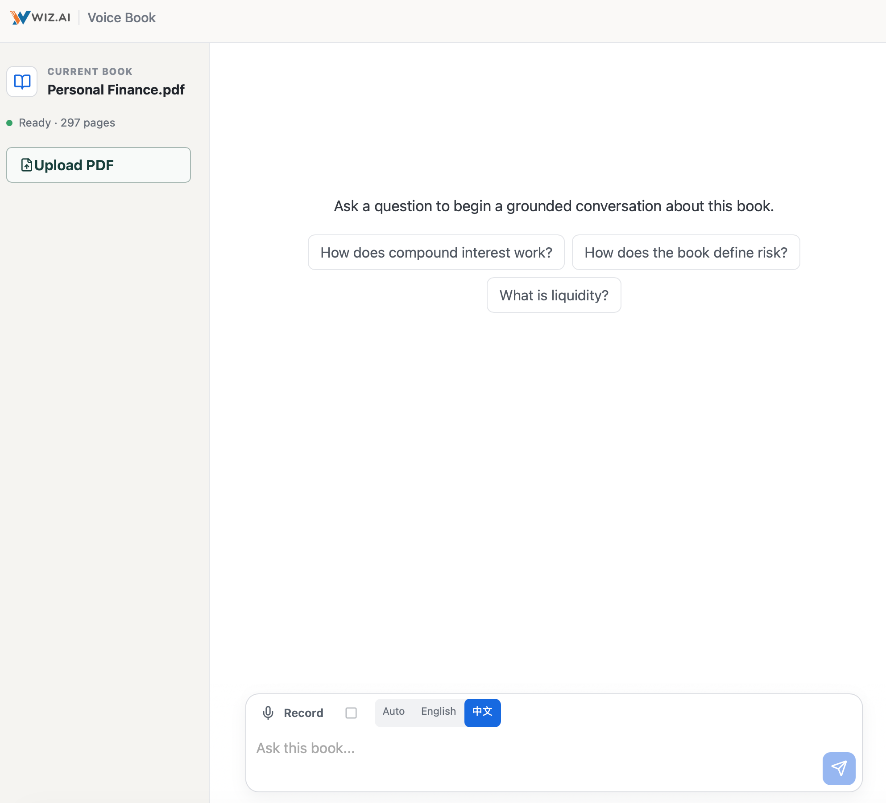
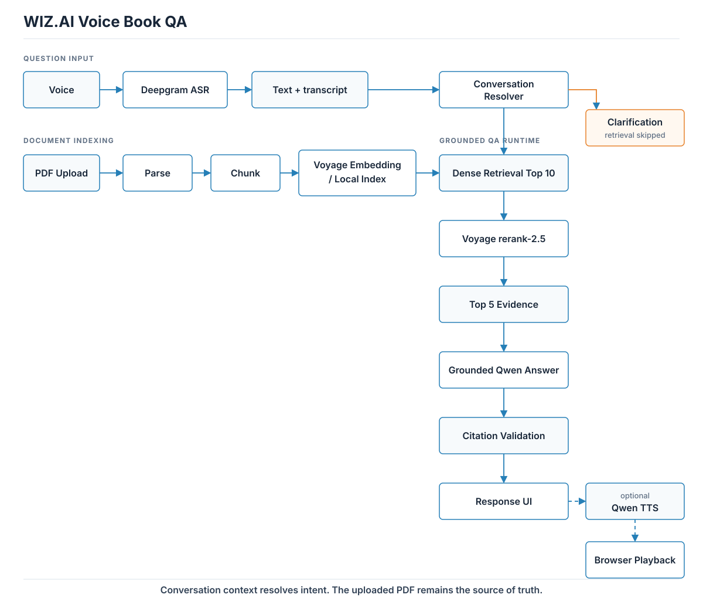

# WIZ.AI Voice Book QA

WIZ.AI Voice Book QA is a voice-first, evidence-grounded assistant for one uploaded PDF book. A reader can ask by text or microphone, edit the transcript, inspect cited passages, and listen to the answer in the browser. The system is intentionally small: a React/Vite client, one FastAPI backend, local document/index storage, and explicit provider boundaries.

<p align="center">
  
</p>

## Demo Flow

```text
PDF upload -> parse and index -> text or voice question
  -> bounded conversation resolution when needed
  -> dense Top 10 -> Voyage rerank-2.5 -> Top 5 evidence
  -> grounded Qwen answer -> citation validation
  -> Qwen TTS -> browser playback
```

The product has one active uploaded book at a time. Conversation context helps resolve short follow-ups, but the PDF remains the source of truth.

## Key Features

- Streamed PDF ingestion with PyMuPDF page provenance and resumable Voyage embedding batches.
- Text input plus browser microphone recording through Deepgram Nova-3 ASR.
- Fixed-window `voyage-4` dense retrieval with local exact cosine similarity.
- Voyage `rerank-2.5` over the dense top 10, followed by a bounded top-5 evidence pack.
- Qwen structured answer generation with local source-ID and citation validation.
- Explicit `answered`, `insufficient_evidence`, `clarification_needed`, and system-error behavior.
- Bounded conversational follow-ups with deterministic chapter/reference cues.
- Qwen `qwen3-tts-flash` synchronous speech synthesis with English and Chinese support.
- Per-turn evidence, trace, latency, and feedback workflow, including a separate `/developer/feedback` page.
- Responsive consumer UI with editable transcripts, source expansion, feedback, and Play/Stop/Replay controls.

## Architecture

<p align="center">
  
</p>

The backend owns credentials, provider calls, parsing, retrieval, evidence packing, schema validation, and traces. The browser owns permissions, transcript editing, visible sources, and audio controls. A separate internal page preserves feedback and trace review without adding authentication or an admin account system.

See [the deeper architecture](docs/ARCHITECTURE.md) for component boundaries and failure handling.

## Retrieval Strategy

The retrieval choice was data-led. Fixed-window dense retrieval, structure-aware alternatives, and local BM25/RRF were compared on the development protocol. Structure-aware chunking and BM25/RRF fixed individual cases but caused broader regressions, so the simpler dense base remained the winner. A controlled reranker experiment then showed a useful ranking improvement without losing evidence coverage.

Naive fixed-size chunking was not assumed sufficient: structure-aware and lexical/fusion alternatives were evaluated, and the fixed-window dense base was retained only because the labeled evaluation favored it.

The frozen production path is:

```text
voyage-4 dense candidates (K=10)
  -> Voyage rerank-2.5
  -> evidence cut (N=5)
  -> existing bounded evidence pack
```

On the 11 answerable Personal Finance draft cases, dense Top 10 had Recall `1.0000`, MRR `0.7689`, and full evidence coverage `1.0000`. Reranking the same candidates and keeping five evidence chunks retained Recall `1.0000`, raised MRR to `0.8939`, and retained full evidence coverage `1.0000`. Candidate pools of 20 and 30 provided no additional Personal Finance coverage. On the Alice DEV regression set, reranked MRR improved from `0.8562` to `0.9417` with full evidence coverage preserved at N=5.

These are retrieval metrics on the named datasets, not general answer accuracy. The reranker measurement covered 96 real requests with p50 latency of about 292 ms and p95 of about 491 ms; provider errors and retries were zero in that run.

## Conversation Design

This is a conversation-aware grounded RAG system with bounded orchestration, not an autonomous agent. Up to four recent completed turns may help resolve references such as “this chapter”; previous `resolved_query` values are included when available. The resolver produces a standalone query or asks for clarification, after which the normal retrieval and answer path runs.

Previous assistant answers are context for resolving intent only. They are never treated as book truth. Unresolved references skip retrieval and show only the clarification request. There is no LangGraph, ReAct loop, or long-term conversation database: the action space is small, predictable, and easier to test with explicit stages.

## Grounding and Failure Semantics

- `answered` requires evidence-supported content and valid cited source IDs.
- `insufficient_evidence` means the supplied book evidence is not enough for a safe answer; it does not invent citations. Closest passages, when shown, are explicitly not supporting evidence.
- `clarification_needed` is used before retrieval when a reference cannot be resolved safely.
- Provider and application failures remain system errors and are not converted into semantic answers.
- Qwen output is parsed and validated locally. One bounded schema-repair attempt is available for serialization/schema-format failures, using the same evidence and recorded in the turn trace.
- A reranker provider failure falls back to dense retrieval and is recorded; it does not fail the whole QA turn.
- TTS failure leaves the answer, evidence, and citations visible.

## Voice Pipeline

Voice input uses browser `MediaRecorder` output and Deepgram Nova-3. The recording language can be Auto, English, or Chinese; the selected mode is passed to ASR, and active-book vocabulary can be supplied as keyterms when available. ASR and TTS readiness are independent.

Voice output uses Qwen `qwen3-tts-flash`, voice `Cherry`, and synchronous Singapore Model Studio synthesis. The browser Play control resumes paused audio, Stop pauses without resetting the position, and Replay resets `currentTime` to zero and reuses the already-loaded audio. No provider credentials are exposed to the browser.

## Setup

Prerequisites:

- Python 3.12
- `uv` or `pip`
- Node.js 20 or newer
- A modern browser with `MediaRecorder`
- Provider access for Deepgram, Voyage, and Alibaba Cloud Model Studio/Bailian in the configured Singapore region

From a fresh clone:

```sh
uv venv backend/.venv
uv pip install --python backend/.venv/bin/python -r backend/requirements.txt
npm ci --prefix frontend
cp backend/.env.example backend/.env
```

Fill the local environment file with values for the variable names in the template:

```dotenv
DASHSCOPE_API_KEY=
DASHSCOPE_BASE_URL=
QWEN_MODEL=
DEEPGRAM_API_KEY=
VOYAGE_API_KEY=
```

The answer model is `qwen3.7-plus-2026-05-26`; TTS uses `qwen3-tts-flash`. Keep secrets only in the gitignored `backend/.env`.

Start the backend and frontend in separate terminals:

```sh
backend/.venv/bin/uvicorn main:app --app-dir backend --host 127.0.0.1 --port 8000
npm run dev --prefix frontend
```

Open <http://127.0.0.1:5173>. Upload a text-based PDF, wait for `Ready`, then ask a question. Uploaded documents, SQLite metadata, checkpoints, and provider caches live under gitignored `backend/data/`. There is no application-level PDF file-size limit; practical limits depend on local disk, parsing, provider limits, and available time. Scanned/image-only PDFs are detected and reported because OCR is outside this submission.

## Testing and Evaluation

Deterministic checks:

```sh
npm run check --prefix frontend
npm run build --prefix frontend
backend/.venv/bin/python -m unittest discover -s backend -p 'test_*.py'
```

The clean-clone verification for this submission passed 108 backend tests, the frontend check, and the frontend production build. Routine provider tests are mocked. Narrow live smoke tests were used only to validate provider contracts, browser media formats, and latency; they consume quota and are not part of the ordinary test command.

Evaluation artifacts are kept under [`eval/`](eval/README.md). They include retrieval experiments, Personal Finance reranker measurements, conversation acceptance data, and historical answer-quality checks. The 98-case evaluation corpus is frozen; final Alice TEST and Secret Garden holdout runs are not silently regenerated by setup or unit tests.

Acceptance testing matters here. An Alice acceptance pass exposed a false-positive conversation cue, which led to a targeted resolver/context fix. The resulting Personal Finance conversation artifact reports 15 cases: rewrite success `7/7`, standalone bypass `4/4`, clarification `3/4`, and action classification `14/15`. Those figures describe that artifact, not a universal quality guarantee. See [Evaluation](docs/EVALUATION.md) for dataset boundaries and caveats.

## AI-Assisted Engineering Workflow

I, the candidate, set scope, selected providers, curated evidence labels, reviewed diffs, interpreted metrics, supplied local credentials, and accepted tradeoffs. ChatGPT was used for architecture reasoning, experiment design, and review. Codex was used for focused implementation, tests, browser checks, repository cleanup, and documentation.

The operating rule was simple: AI suggestions became product behavior only after code inspection, a focused test, a measured experiment, or a human acceptance check. Concrete examples include rejecting structure-aware/BM25 complexity after broader retrieval regressions, keeping the system as bounded orchestration instead of adding an agent framework, fixing a conversation-gate cue after acceptance exposed it, and preserving insufficient evidence as a separate state from provider failure.

See [AI workflow](docs/AI_WORKFLOW.md) for the review loop and testing boundaries.

## Limitations and Deliberate Non-Goals

- Text-based PDFs are supported; scanned PDFs do not receive OCR.
- The product indexes one active book rather than a multi-document knowledge base.
- Conversation context is bounded short-term context, not long-term memory.
- There is no autonomous agent, ReAct loop, or multi-user production layer.
- There is no authentication, RBAC, multi-user account layer, or hosted production deployment.
- Provider availability, quota, regional model access, and latency remain external dependencies.
- Local storage and exact-cosine indexing are appropriate for this take-home scope, not a claim of multi-tenant scale.
