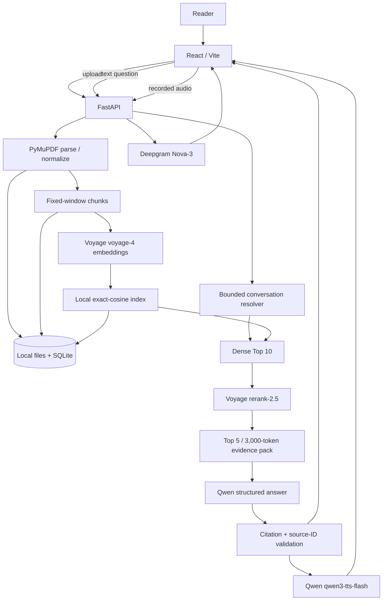

# Architecture

## System Boundary

The product is a React/Vite browser client backed by one FastAPI application. It is designed for one active uploaded book and a single local application deployment. Provider credentials, PDF parsing, retrieval, grounding checks, and traces stay on the backend. The browser handles permissions, transcript editing, visible evidence, feedback controls, and audio playback.

## Ingestion

The upload is streamed to disk and represented by durable processing state. PyMuPDF extracts page text and provenance, common whitespace and line-break artifacts are normalized, and the parser creates stable fixed-window chunks. Chunks are embedded in bounded batches with resumable checkpoints. A local matrix supports exact cosine similarity for one active document.

The index is published only after the required artifacts are complete. A failed or cancelled job does not expose a partial ready index. Empty or image-only PDFs return an explicit OCR-not-supported result rather than pretending that no evidence exists. The application does not impose a separate PDF byte-size limit; actual limits are local disk, parser cost, provider limits, and available processing time.

## Question and Retrieval Flow

1. The browser submits text or an edited ASR transcript.
2. The bounded resolver runs only when history and deterministic follow-up cues justify it. It can return a standalone query or a clarification before retrieval.
3. The backend retrieves dense `voyage-4` candidates using exact cosine similarity.
4. The production candidate pool is explicit: `DENSE_CANDIDATE_K = 10`.
5. Voyage `rerank-2.5` scores those candidates. A provider failure falls back to the dense order and is recorded in `TurnTrace`.
6. The reranked top five are passed into the existing evidence pack under an estimated 3,000-token budget.
7. Qwen receives only the user query, bounded evidence, and answer contract.
8. Local validation checks status, required fields, and that every citation source ID exists in the supplied evidence.
9. The response contains the answer state, citations, evidence, timing, and trace metadata.

The reranker changes ranking only. It does not change chunking, embeddings, dense similarity, citation semantics, or the answer-generation prompt's grounding requirements.

## Conversation Boundary

The conversation layer is bounded orchestration, not an autonomous agent. Up to four recent completed turns may be used for follow-up resolution, and previous resolved queries are included when available. This lets phrases such as “this chapter” inherit an explicit topic anchor while keeping the actual retrieval query standalone.

Conversation context excludes citations, evidence, audio, and feedback. Previous assistant answers are not book truth. If the chapter or topic cannot be established, the resolver returns clarification and retrieval is skipped; the UI does not show closest passages for a pre-retrieval clarification.

## Grounding Contract

The semantic states are:

- `answered`: evidence supports the response and valid source IDs are cited.
- `insufficient_evidence`: the supplied evidence is inadequate. It may show closest checked passages, but those are not supporting citations.
- `clarification_needed`: the question requires a missing or unresolved reference.
- system error: an application or provider failure prevented a valid grounded result.

Qwen responses are parsed and schema-validated. If the provider returns a serialization-only defect, one bounded repair attempt may reuse the same evidence; it is recorded in the trace. Citation validation is never removed, and unsupported claims are not turned into answers by repair.

## Voice Boundary

ASR and TTS are independent capabilities. Deepgram Nova-3 handles browser recordings, with Auto, English, and Chinese language modes and optional active-book keyterms. Qwen `qwen3-tts-flash` with the Cherry voice handles synchronous browser-playable speech. The answer is rendered before TTS completes, and TTS failure leaves the answer and evidence intact.

Playback semantics are intentionally small: Play resumes paused audio and starts ended audio from the beginning; Stop pauses without resetting `currentTime`; Replay resets `currentTime` to zero and plays the already-loaded audio without another synthesis request.

## Feedback and Internal Review

Consumer feedback is linked to a turn trace through `POST /api/feedback`. The internal developer page at `/developer/feedback` displays the question, answer state, citations, evidence, trace/debug metadata, review status, and reviewer note. It is a separate product surface with no authentication, RBAC, or user-account system.

## Failure Boundaries

- ASR failure stops voice transcription; it does not disable typed QA or TTS.
- Empty or unusable audio is not submitted as a question.
- Retrieval and reranking failures are traced; reranking can fall back to dense results.
- Inadequate evidence is a semantic `insufficient_evidence` result, not a provider error.
- Invalid JSON or invalid source IDs are rejected.
- TTS failure is isolated from answer and citation rendering.
- A new question cancels stale work and stops old playback.

## Design Decisions and Non-Goals

The system does not use agents, GraphRAG, a managed vector database, OCR, multi-book search, permanent memory, Kubernetes, or full-duplex streaming voice. These would add operational or reasoning complexity without a demonstrated requirement in the measured take-home scope. Local files, SQLite, and exact cosine are deliberate choices for reproducibility, not multi-tenant scale claims.
