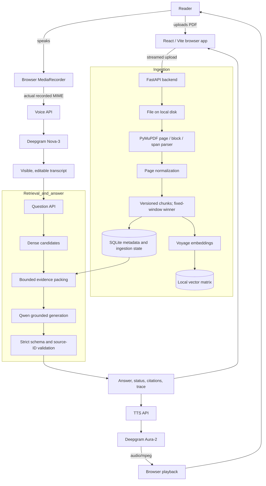

# Architecture

## Goal

The system is a voice-first assistant that answers questions from one uploaded PDF book. Its core contract is evidence before generation: a fluent answer without supporting book passages is a failure.

The architecture is deliberately a React client and one FastAPI application. Provider APIs remain behind the backend, while local storage and indexes keep the submission easy to reproduce.

## Full system diagram



Optional retrieval stages are experiment-gated. The final pipeline may be simpler than the candidate pipeline.

## Ingestion flow

```text
upload
  -> stream to disk
  -> processing state
  -> parse one page at a time
  -> normalize common whitespace and line-break artifacts
  -> create fixed-window chunks with stable IDs and page provenance
  -> embed in bounded batches
  -> build local indexes
  -> atomically publish one ready index version
```

An ingestion version is queryable only after all required artifacts are ready. Failure moves the document to `failed`; it never exposes a partial index. Image-only or effectively empty PDFs receive an explicit “OCR not currently supported” result.

## Question flow

1. The browser requests microphone permission and records through `MediaRecorder`.
2. The browser sends the recording with the MIME type reported by the recorder.
3. Deepgram Nova-3 returns a transcript and ASR latency.
4. The user can correct names, numbers, or other ASR errors before asking.
5. Retrieval produces candidates independently of the LLM.
6. Evidence is packed under a fixed token budget with stable source IDs.
7. Qwen receives only the question, bounded evidence, and output contract.
8. Strict schema parsing and a deterministic validator reject nonexistent source IDs.
9. The UI displays the answer, page/chapter citations, supporting passages, and stage latencies.
10. Aura-2 synthesizes the answer. A TTS failure leaves the text and citations usable.

## Answer contract

The semantic statuses are:

- `answered`: supplied evidence supports the answer and at least one valid source is cited.
- `insufficient_evidence`: the book evidence does not support a safe answer.
- `clarification_needed`: the question has materially different interpretations.
- `system_error`: the application or an external dependency failed; this is produced by deterministic application error handling rather than treated as a model answer.

PDF text is untrusted data. Instructions contained inside the document cannot override the answer-generation contract.

## Provider choices

| Responsibility | Choice | Reason | Main tradeoff |
|---|---|---|---|
| ASR | Deepgram Nova-3 | Real browser audio formats and English speech path validated | External latency, quota, and availability |
| TTS | Deepgram Aura-2, `aura-2-thalia-en` | Same voice provider as ASR; real MP3 playback validated | Non-streaming REST response adds perceived latency |
| LLM | Qwen `qwen3.7-plus-2026-05-26` through Bailian Singapore | Existing access; strict JSON Schema and required answer states passed live tests | Regional account/model availability must remain valid |
| Embeddings | Voyage `voyage-4` | Real document/query embeddings and retrieval metrics validated | External quota requires paced indexing and checkpoints |
| Reranker | Disabled | Only one pure DEV ranking failure remained after experiments | Avoids provider latency, quota use, and another failure path |
| PDF parser | PyMuPDF | Page, block, span, font, and position information | Heading and reading-order heuristics still require inspection |
| Dense index | Local vector matrix with exact cosine | Simple, deterministic, adequate for one book | Does not target a multi-book production corpus |
| Lexical index | Rejected after DEV experiment | BM25/RRF fixed q010 but created three regressions and did not fix q021 | Dense-only winner keeps the stronger quality/complexity trade-off |
| Metadata | Local SQLite | Atomic ingestion state and simple provenance queries | Single-process scope is intentional |

## Retrieval decision

The baseline was fixed-size chunking with dense retrieval. Experiments then added one change at a time:

1. structure-aware chunking;
2. local BM25 plus reciprocal-rank fusion;
3. the reranker evidence gate; the provider experiment was skipped because only one pure ranking failure remained.

On the frozen 20-question DEV set, fixed-window dense had the strongest Recall@5 and MRR@5. Structure-aware chunking and BM25/RRF each fixed q010 but caused broader regressions. The final retriever is therefore fixed-window `voyage-4` exact cosine; BM25/RRF and reranking are disabled. The matching one-time 10-question TEST run achieved 100% Recall@5 and full evidence coverage@5. Full evidence and rejected alternatives are recorded in [the retrieval experiment log](RETRIEVAL_EXPERIMENTS.md).

## Reliability boundaries

- ASR failure stops the turn before retrieval.
- Empty/no-speech transcription is not converted into a generated question.
- Evidence below the calibrated threshold produces `insufficient_evidence`.
- Invalid LLM JSON or citations are rejected by the backend.
- TTS failure does not remove the answer or evidence.
- Starting a new question cancels stale requests and stops old audio.
- Each stage records latency so a bad case can be attributed to ASR, parsing, retrieval, ranking, packing, generation, or TTS.

## Deliberate non-goals

No agents, GraphRAG, distributed workers, managed vector database, multi-user authentication, permanent memory, multi-book search, default OCR, Kubernetes, or full-duplex voice are planned for the take-home. They increase delivery risk without a measured need in the assignment.
